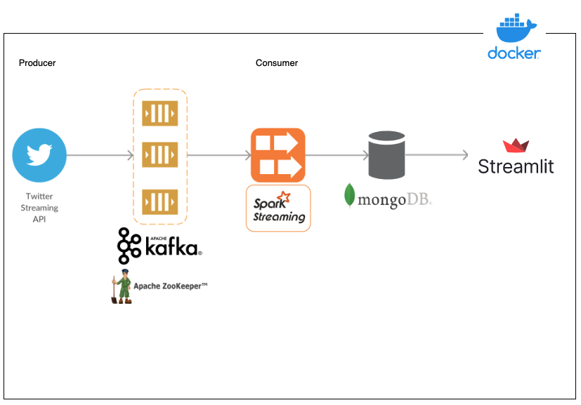

# Twitter Sentiment Analysis

## Overview



This application will collect some tweets, push to Kafka via tweepy, use PySpark to monitor the topic and push to a mongoDB database. Finally Streamlit is used to show a real time view of the data being generated.

## Requirements

- Get an access to the Twitter API via [How to get access to the Twitter API](https://developer.twitter.com/en/docs/twitter-api/getting-started/getting-access-to-the-twitter-api)
  
## Setup

- Clone the repo
- After obtaining your set of Twitter API keys and tokens, you have to set those in a env file in the produce directory :

```
consumer_key=xxxx
consumer_secret=xxxx
bearer_token=xxxx
access_token=xxxx
access_token_secret=xxxx
```

### Starting the Services

Services need to be started in a specific order with the following commands:
```
# Start Kafka and MongoDB
docker-compose up -d kafka db

# Start Spark
docker-compose up -d spark spark-worker spark-worker2

# Start the producer and the consumer
docker-compose up -d producer consumer

# Start Streamlit
docker-compose up streamlit
```